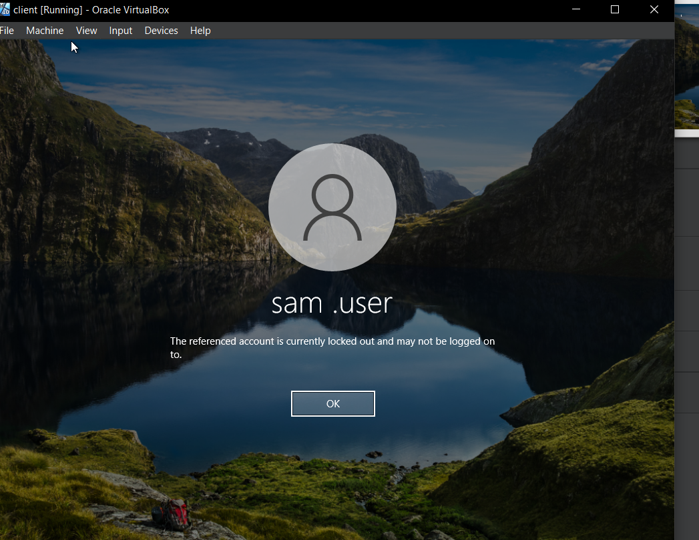
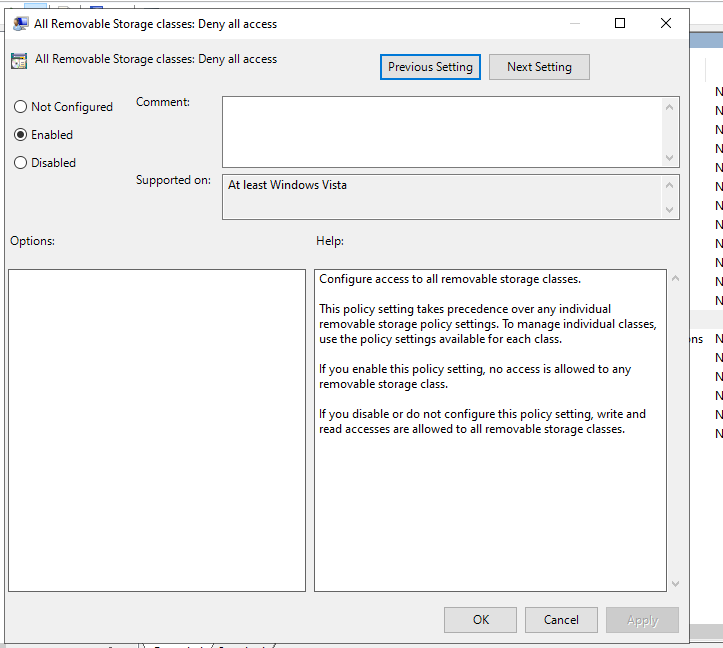
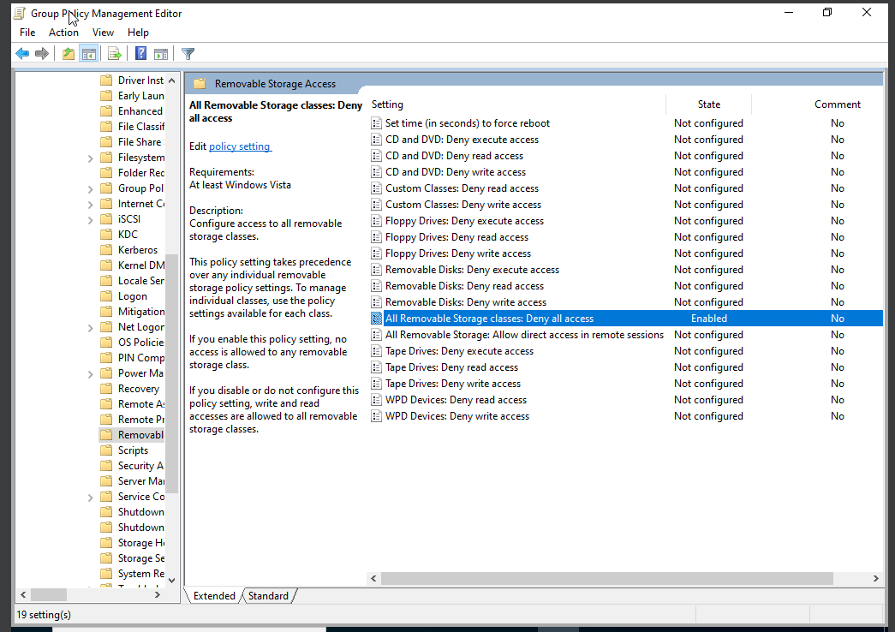
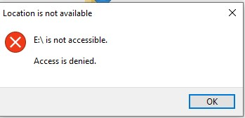

# IT-Support-System-Admin-Lab
Active Directory, DNS, and GPO home lab project

## 📌 Overview
This project demonstrates a hands-on IT support lab built using virtualization. It simulates real-world user management, system configuration, and troubleshooting tasks.

---

## 🔹 Tools & Technologies
- Oracle VM VirtualBox  
- Windows Server 2022  
- Windows 10  
- Active Directory  
- DNS Server  

---

## 🔹 Lab Setup
- Created virtual machines using VirtualBox  
- Installed Windows Server 2022 and Windows 10  
- Promoted server to Domain Controller  
- Joined Windows 10 client to domain

### ✅ Windows Server Configuration

### ✅ Client Joined to Domain

  

---

## 🔹 Configurations

### ✅ Active Directory
- Created and managed user accounts  
- Managed computer objects  

---

# ⚡ PowerShell Administration

Used PowerShell to automate Active Directory administration tasks such as creating Organizational Units (OU), security groups, and domain users.

Configured user accounts and added users to department groups using PowerShell commands, then verified the changes in Active Directory Users and Computers.

---

### ✅ OU and Group Creation using PowerShell

Created Organizational Units and security groups using PowerShell.

---

### ✅ User Creation using PowerShell

Created domain user accounts using PowerShell commands.

---

### ✅ Added Users to Security Groups

Added users to department security groups using PowerShell.

---

### ✅ Active Directory Verification

Verified that the users and groups were successfully created inside the correct Organizational Unit in Active Directory Users and Computers.

---

### ✅ Group Membership Verification

Verified that users were successfully added to the correct security groups.

---

# 🌐 DNS Configuration

Configured Active Directory-integrated DNS with forward and reverse lookup zones for hostname resolution.

## 🔹 DNS Zone

## 🔹 Forward Lookup Zone

## 🔹 Reverse Lookup Zone

## ✅ DNS Resolution Test

### ✅ Group Policy (GPO)

#### 🔐 Account Lockout Policy
- Locks account after 3 incorrect password attempts  
- Automatically unlocks after 3 minute  

### ✅ Locked User Account

Verified account lockout behavior after multiple failed login attempts.

---

#### 🔐 USB Restriction Policy
- Blocked access to external USB devices
-  Configured Group Policy to block access to all removable storage devices.

### ✅ Group Policy Applied

Verified that the removable storage restriction policy was successfully applied.

### ✅ USB Access Blocked

Verified that removable storage access was denied on the client machine after applying the Group Policy.

---

### ✅ Audit Policy
- Enabled logging for account lockout and login failures  

---
### ✅ File Sharing Configuration
- Configured shared folders on Windows Server  
- Assigned access permissions to specific users  
- Tested file access from client machine within domain  

Below is the shared folder configuration and access from client:

## 🔹 Troubleshooting Scenarios
- Resolved user password reset issues  
- Unlocked locked user accounts  
- Diagnosed login failures using audit logs  

---

## 🔹 Outcome
- Gained practical experience in IT support tasks  
- Improved troubleshooting and system administration skills  
