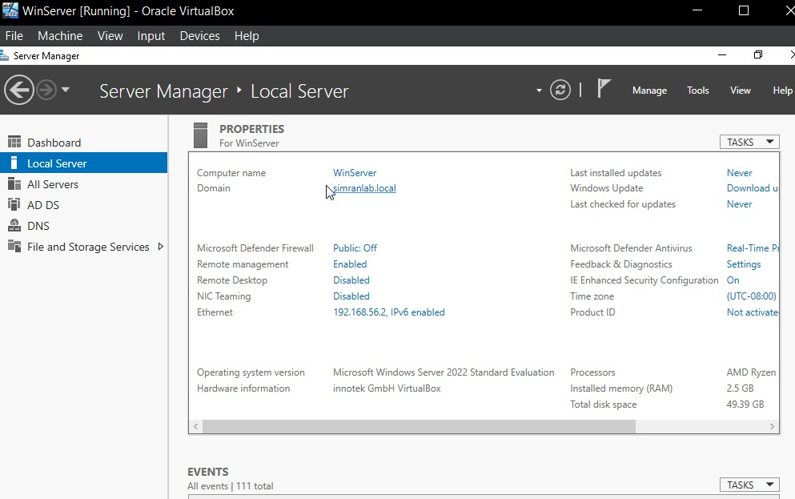
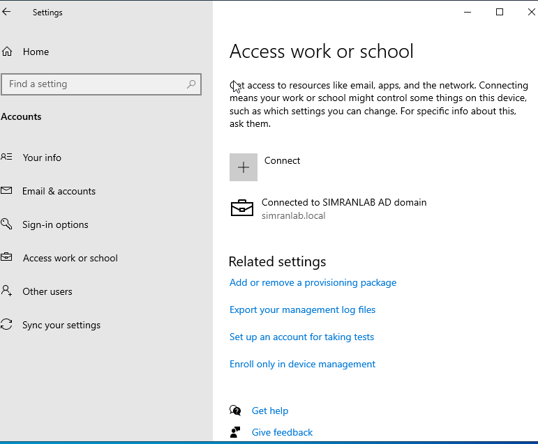
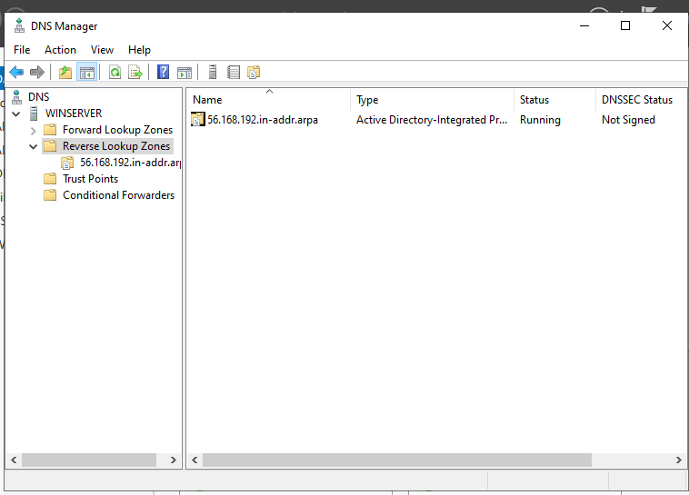
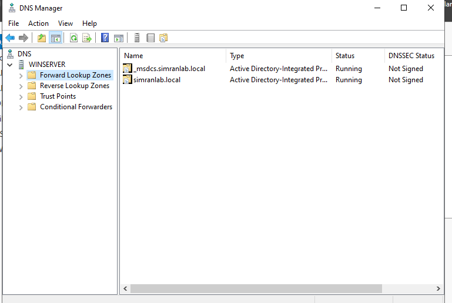
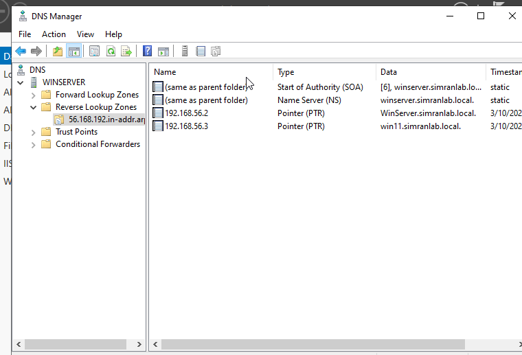
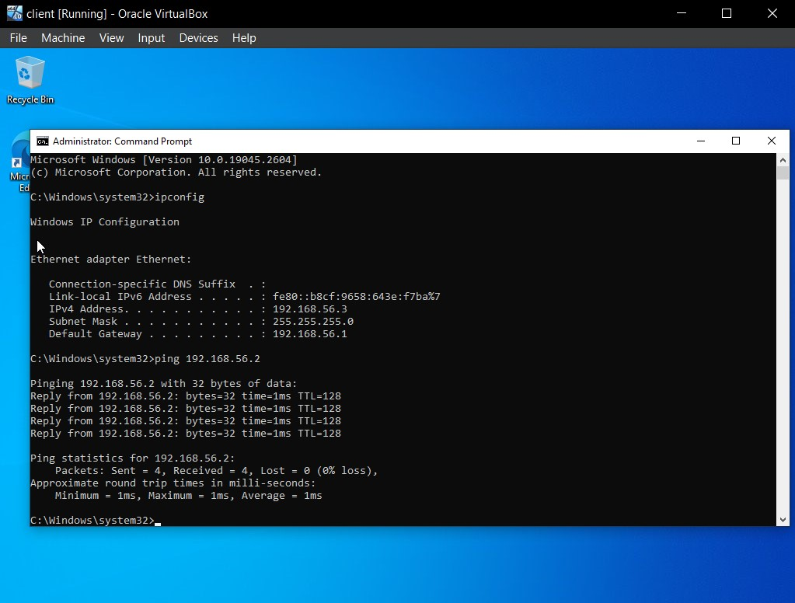
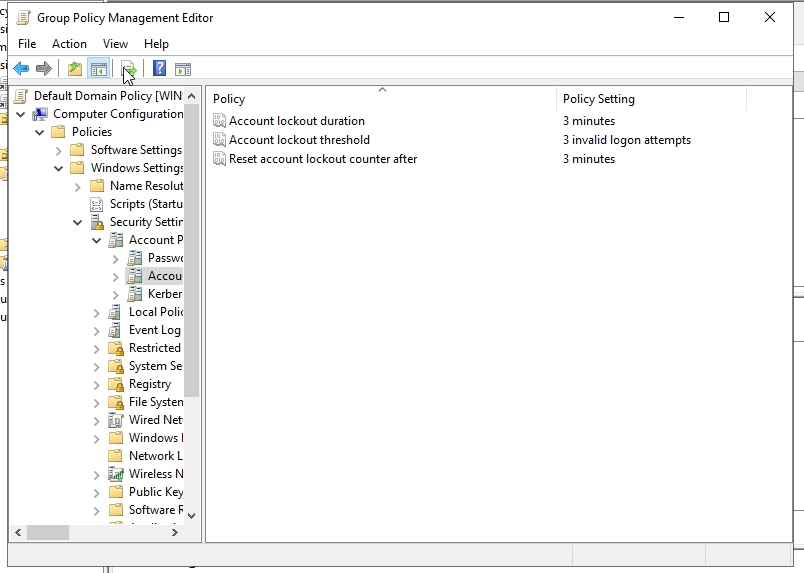

# IT-Support-System-Admin-Lab
Active Directory, DNS, and GPO home lab project

## 📌 Overview
This project demonstrates a hands-on IT support lab built using virtualization. It simulates real-world user management, system configuration, and troubleshooting tasks.

---

## 🔹 Tools & Technologies
- Oracle VM VirtualBox  
- Windows Server 2022  
- Windows 10  
- Active Directory  
- DNS Server  

---

## 🔹 Lab Setup
- Created virtual machines using VirtualBox  
- Installed Windows Server 2022 and Windows 10  
- Promoted server to Domain Controller  
- Joined Windows 10 client to domain

### ✅ Windows Server Configuration

### ✅ Client Joined to Domain

  

---

## 🔹 Configurations

### ✅ Active Directory
- Created and managed user accounts  
- Managed computer objects  

---

# 🌐 DNS Configuration

Configured Active Directory-integrated DNS with forward and reverse lookup zones for hostname resolution.

## 🔹 DNS Zone

## 🔹 Forward Lookup Zone

## 🔹 Reverse Lookup Zone

## ✅ DNS Resolution Test

### ✅ Group Policy (GPO)

#### 🔐 Account Lockout Policy
- Locks account after 3 incorrect password attempts  
- Automatically unlocks after 3 minute  

### ✅ Locked User Account

Verified account lockout behavior after multiple failed login attempts.

---

#### 🔐 USB Restriction Policy
- Blocked access to external USB devices  

---

### ✅ Audit Policy
- Enabled logging for account lockout and login failures  

---
### ✅ File Sharing Configuration
- Configured shared folders on Windows Server  
- Assigned access permissions to specific users  
- Tested file access from client machine within domain  

Below is the shared folder configuration and access from client:

## 🔹 Troubleshooting Scenarios
- Resolved user password reset issues  
- Unlocked locked user accounts  
- Diagnosed login failures using audit logs  

---

## 🔹 Outcome
- Gained practical experience in IT support tasks  
- Improved troubleshooting and system administration skills  
